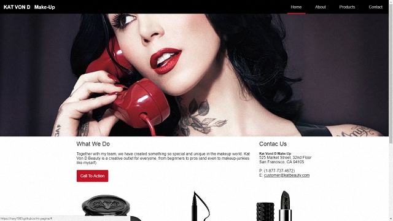

# MI PAGINA

Kate Von D make-up página responsive donde se hace uso de la grid.

***

***

### RETO

En este reto, vamos a realizar una página a nuestro gusto.

El diseño lo puedes realizar como mejor te parezca, pero debes mantener la estructura de la página y debes realizarlo con un grid (cualquiera pero que no sea un framework como Bootstrap o Materialize).

***

### HERRAMIENTAS DE TECNOLOGIA APLICADAS

+ HTML 5

+ CSS 3

***

### ELABORADO PARA:

***

### ELABORADO POR:

* Nadya Salazar alias **Navy**